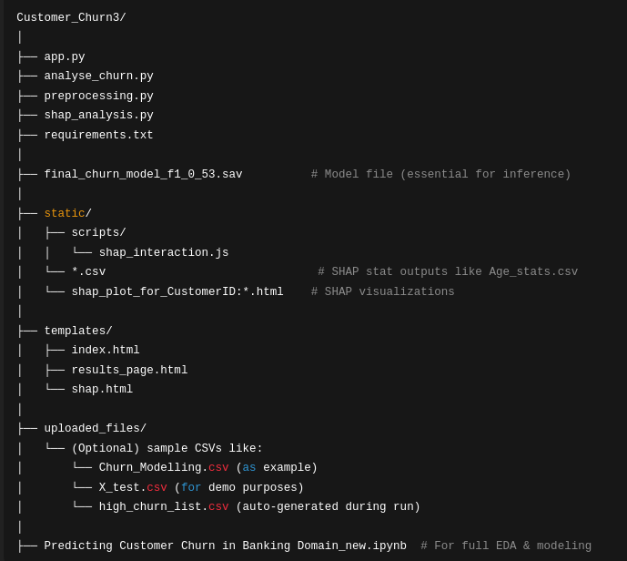

# Customer Churn Prediction Web App

A full-stack machine learning app built using Flask to predict customer churn in the banking sector, explain predictions using SHAP, and generate actionable churn insights.

---

## 📌 Project Overview

This project identifies customers who are likely to leave a bank and helps target them with personalized interventions. It includes:

- Uploading test data
- Predicting churn probability
- Generating a list of high-risk customers based on a custom threshold
- SHAP-based interpretability per customer
- Aggregate churn analysis by demographic and account features

---

## 📂 Project Structure

Below is the overall directory layout of the project:



---

## 🚀 How to Run Locally

### 1. Clone the Repository
```bash
git clone https://github.com/yourusername/customer-churn-app.git
cd customer-churn-app

### 2. Create & Activate Virtual Environment
python3 -m venv venv
source venv/bin/activate

### 3. Install Dependencies
pip install -r requirements.txt

### 4. Run the App
python app.py
The app will run on http://localhost:5000
## 💡 Features

    Churn Prediction: Upload test dataset (without labels) and predict churn probabilities.

    Custom Threshold: Choose threshold for flagging risky customers.

    Aggregate Analysis: Visualize how features like Age, CreditScore, Geography affect churn.

    SHAP Explainability: Understand which features contributed to an individual customer's churn decision.

    Modular Code: Organized into scripts for preprocessing, SHAP, analysis, and routing.

## 🧪 Example Dataset

Use the provided uploaded_files/X_test.csv or your own dataset with the following columns:
['CustomerId', 'Surname', 'CreditScore', 'Geography', 'Gender', 'Age',  'Tenure', 'Balance', 'NumOfProducts', 'HasCrCard', 'IsActiveMember', 'EstimatedSalary']

## 📊 Model Info

    Algorithm: XGBoost Classifier

    Custom Threshold: 0.53 (optimized for best F1-score)

    Explainability: SHAP (TreeExplainer)

    Custom Features:

        balance_per_product

        balance_by_estimated_salary

        tenure_age_ratio, etc.
## 📎 Credits

Developed by [Your Name / Ecube Analytics]
For educational purposes & real-world deployment demos.

## 📄 License

MIT License
